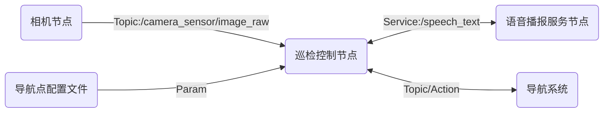
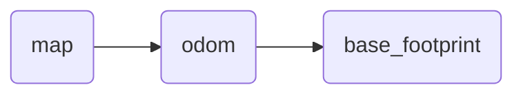

# 架构设计
目的：
- 做一个在各个房间不断巡检的机器人
  - 能在不同目标点循环移动
  - 到达一个目标点后语音播报
  - 通过摄像头采集一张实时图像并保存到本地

需求分析：
- 导航功能
  - 通过Nav2实现
  - 需要通过参数机制来设置导航点
- 语音播报功能
  - 基于语音合成相关库实现
  - 需要自定义服务接口，实现服务端的同步播报
- 保存实时图像
  - 订阅相机节点发布的图像话题，再将得到的数据转换为OpenCV格式进行保存

前置要求：
- 建模
- 导航

架构图：

# 巡检控制节点

## 关键TF结构

## 四元数与欧拉角

欧拉角由**偏航**(Yaw)，**俯仰**(Pitch)和**滚转**(Row)组成，分别代表绕Z轴，Y轴，X轴**顺时针**旋转的角度。

四元数由标量部分和矢量部分组成，目的是解决欧拉角中的万向节锁问题

[四元数与欧拉角的转换](https://blog.csdn.net/gzt19881123/article/details/143596670)

## 控制节点实现

目的：
1. 机器人位姿初始化`init_robot_pose`
2. 导航到指定位姿
   - 导航到指定位姿(self.nav_to_pose)-->self.goToPose(**target_pose**)
   - **target_pose**由参数文件给出，需要由文件中的[x,y,yaw]格式转换为`geometry_msgs/PoseStamped`格式
     - 引入方法`get_target_points`来从文件中分组获得目标点
     - 引入方法`get_pose_by_xyyaw`来将目标点信息转换为`PoseStamped`格式
3. 其他工具类方法
   - 通过TF获得目前位姿`get_current_pose`

# 语音播报功能

1. 定义服务接口
   1. 创建接口功能包(添加`rosidl_default_generators`依赖)
   2. 编写接口文件
   3. 在CMakeList中使用`rosidl_generate_interfaces`进行注册
2. 编写节点代码
   1. 在主功能包中创建节点文件，创建服务端，完成逻辑
   2. 在`setup.py`中注册节点
3. 在主节点中调用
   1. 添加服务的客户端
   2. 调用服务播放语音
4. 在launch文件中设置启动节点与参数
   1. 获取与拼接参数文件路径
   2. 附带参数启动节点

# 图像记录功能

1. 订阅消息`/camera_sensor/image_raw`,通过回调函数保存图像
2. 通过`cv_bridge`将图像转换为cv格式，再对图像进行记录